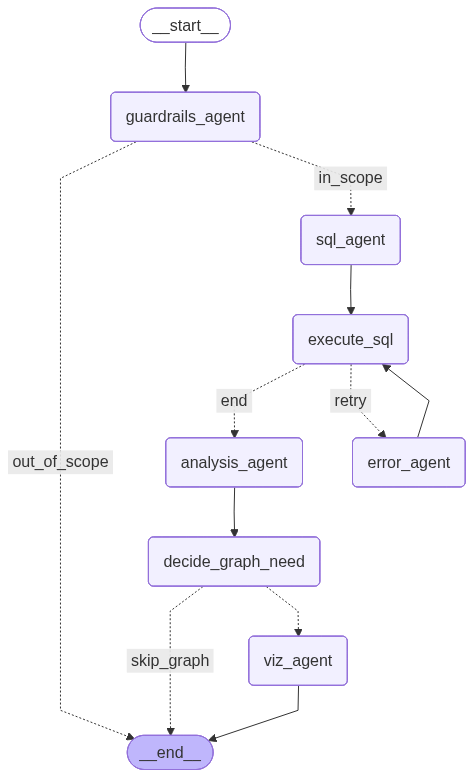

# AI Business Analytics Assistant


An intelligent multi-agent AI system that transforms natural language questions into SQL queries, executes them on an e-commerce database, analyzes the results, and automatically generates interactive visualizations using LangGraph, Chainlit, OpenAI, SQLite, and Plotly.


# Value Proposition
Data analysts and business stakeholders spend hours writing SQL and creating chart visual templates. This system automates the data analysis loop:
*   **Conversational Data Access**: Non-technical users query complex databases in plain English.
*   **Self-Healing Queries**: Catches SQL database syntax execution errors and automatically rewrites queries.
*   **Dynamic Data Visualizations**: Automatically generates Plotly code to build interactive charts (bar, line, pie) tailored to the query output.

# Overview

Business users often need insights from databases without knowing SQL.

This project demonstrates how multiple specialized AI agents can collaborate to translate natural language into SQL, execute database queries, recover from SQL errors, analyze the results, and generate interactive business visualizations.

Rather than acting as a traditional chatbot, the system orchestrates a team of specialized agents to perform a complete business analytics workflow.

---

# System Architecture



The assistant follows a LangGraph-based workflow consisting of specialized AI agents.

Workflow:

1. Validate user request
2. Generate SQL query
3. Execute SQL
4. Recover from SQL errors (if needed)
5. Analyze query results
6. Decide whether visualization is required
7. Generate interactive Plotly charts
8. Return business insights

---

# Key Features

✅ Natural Language → SQL conversion

✅ Multi-Agent architecture using LangGraph

✅ SQL error detection and automatic recovery

✅ Business insight generation

✅ Interactive Plotly visualizations

✅ Guardrails for out-of-scope questions

✅ Streaming agent execution with Chainlit

✅ SQLite backend

---

# Agent Workflow

The application consists of several specialized AI agents.

## Guardrails Agent

- Validates whether questions are related to the business database.
- Rejects out-of-scope requests.
- Handles greetings and general conversation.

---

## SQL Agent

- Converts natural language into optimized SQLite queries.
- Understands database schema.
- Generates syntactically correct SQL.

---

## SQL Execution Agent

- Executes SQL against the SQLite database.
- Returns structured query results.
- Handles multiple SQL statements.

---

## Error Recovery Agent

- Detects SQL execution failures.
- Repairs incorrect SQL.
- Retries execution automatically.

---

## Analysis Agent

- Converts structured query results into business insights.
- Generates concise natural language explanations.

---

## Visualization Agent

- Determines whether charts improve understanding.
- Creates interactive Plotly visualizations.
- Supports multiple chart types.

---

# Example Questions

Users can ask questions such as:

- How many orders were delivered?
  

- What are the top 10 product categories based on their sales?
  

- Show me the order status distribution
  

- Among delivered orders, what percentage arrived after the estimated delivery date, and how does this change by month?
  

- What percentage of customers placed more than one order, and what is their average order value compared to one-time customers?
  

---

# Technology Stack

## AI

- OpenAI GPT-4o-mini
- LangGraph
- Prompt Engineering
- Multi-Agent Systems

## Backend

- Python
- SQLite
- Pandas

## Frontend

- Chainlit

## Visualization

- Plotly

---

# Repository Structure

```text
AI-Business-Analytics-Assistant/

├── README.md
├── LICENSE
├── .gitignore
├── requirements.txt
│
├── app.py
├── text2sql_agent.py
├── db_init.py
│
├── agentic_text2sql_analytics.ipynb
│
└── text2sql_workflow.png
```

---

# Installation

Clone the repository.

```bash
git clone https://github.com/AShirsat96/AI-Business-Analytics-Assistant.git
```

Install dependencies.

```bash
pip install -r requirements.txt
```

Download the **Olist E-commerce Dataset** from Kaggle and place the CSV files inside a folder named:

```text
data/
```

Create the SQLite database.

```bash
python db_init.py
```

Start the application.

```bash
chainlit run app.py
```

---

# Skills Demonstrated

This project demonstrates practical experience with:

- Multi-Agent AI Systems
- LangGraph Workflow Orchestration
- Text-to-SQL Systems
- Prompt Engineering
- SQL Generation
- Error Recovery Workflows
- Business Analytics
- Data Visualization
- SQLite
- Plotly
- Chainlit
- OpenAI API

---

# Future Improvements

Potential future enhancements include:

- Support for PostgreSQL and MySQL
- Database schema auto-discovery
- Role-based access control
- Vector memory for conversation history
- Multi-database support
- Dashboard export
- Docker deployment
- Cloud deployment
- Authentication
- Query optimization

---

# Project Context

This project demonstrates an enterprise-style AI business analytics workflow using a multi-agent architecture.

The system showcases how specialized AI agents can collaborate to automate SQL generation, business analysis, error recovery, and visualization within a single conversational interface.

---

# About the Author

**Aniket Shirsat**

AI Engineer | Data Scientist | Generative AI

🌐 Portfolio  
https://aniketdshirsat.com

💼 LinkedIn  
https://www.linkedin.com/in/aniketshirsatsg/

📧 Email  
aniketdshirsat@hotmail.com

---

# License

This project is licensed under the MIT License.
